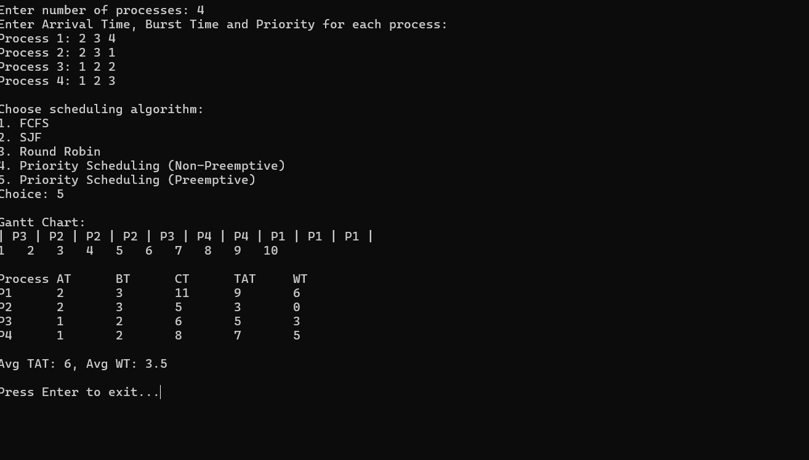

CPU Scheduling Algorithms

This project implements multiple CPU scheduling algorithms in C++ with an interactive command-line interface (CLI). Users can input process details, select a scheduling algorithm, and visualize execution using a Gantt Chart. The program also computes key performance metrics like Completion Time (CT), Turnaround Time (TAT), and Waiting Time (WT) to analyze scheduling efficiency.

Implemented Algorithms

First Come First Serve (FCFS) – Executes processes in arrival order.

Shortest Job First (SJF) – Non-preemptive, selects the shortest burst time.

Round Robin (RR) – Allocates fixed time slices (quantum) to each process.

Priority Scheduling – Preemptive & non-preemptive, highest-priority runs first.

Features

User Input – Enter Arrival Time, Burst Time, and Priority.

Gantt Chart Visualization – Displays execution order.

Performance Metrics – Computes CT, TAT, and WT for efficiency analysis.

Multiple Algorithms – Choose scheduling dynamically.

How to Run

Compile the program using a C++ compiler:

g++ scheduling.cpp -o scheduling

Run the executable:

./scheduling

Follow the on-screen prompts to input process details and select an algorithm.
